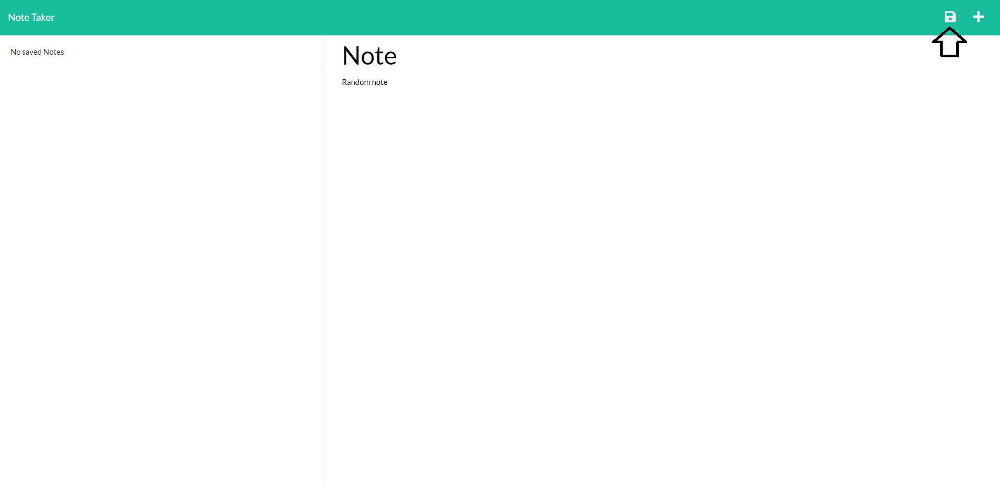
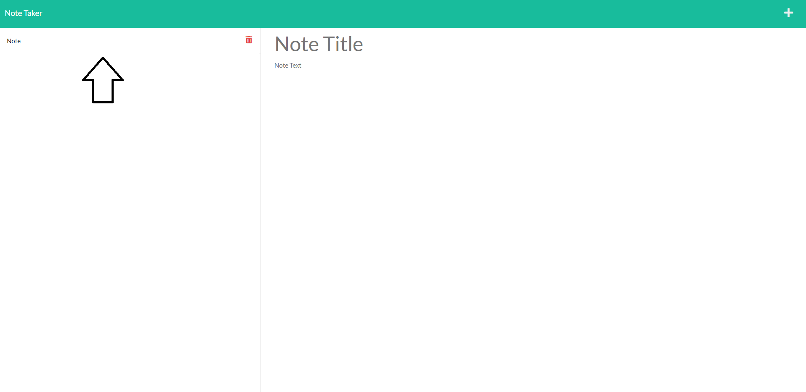
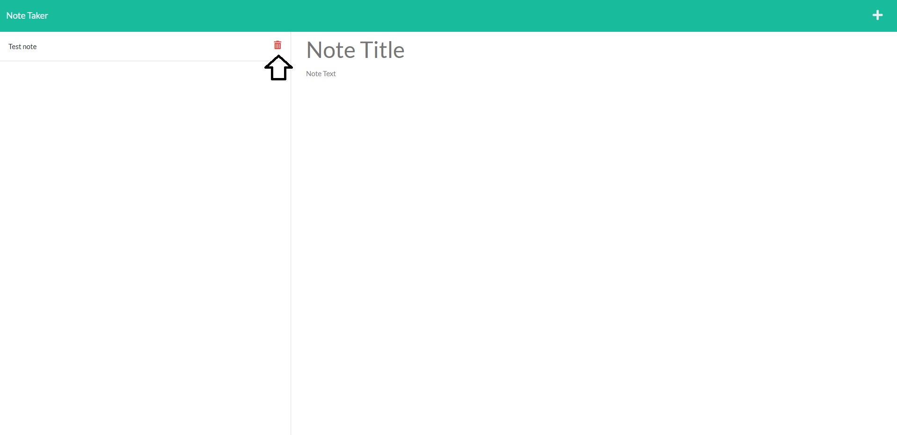
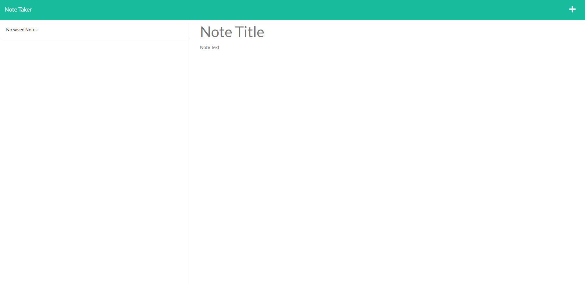

# _Note-Taker_
A simple app that allows to create notes efficiently based on the input of the user.
> Live demo [_here_](https://note-taker-io.herokuapp.com/). 

## Table of Contents
* [Technologies Used](#technologies-used)
* [Features](#features)
* [Screenshot](#screenshot)
* [Project Status](#project-status)
* [Room for Improvement](#room-for-improvement)

## Technologies Used
- Tech 1 - JavaScript
- Tech 2 - Express
- Tech 3 - Node.js
- Tech 4 - Heroku
- Tech 5 - HTML
- Tech 6 - CSS

## Features
Ready Features:
1. **Allows to create notes**

2. **Allows to view the title of the note**
3. **Allows to view the content of the note**
4. **Allows to delete notes that aren't needed anymore**
  
  

## Screenshot
### Note Taker:

## Project Status
Project is: _in progress_

## Room for Improvement
Room for improvement:
- TBD

To do:
- Improve design
- Add due date
